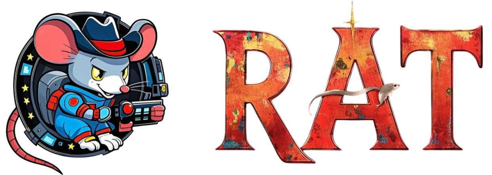
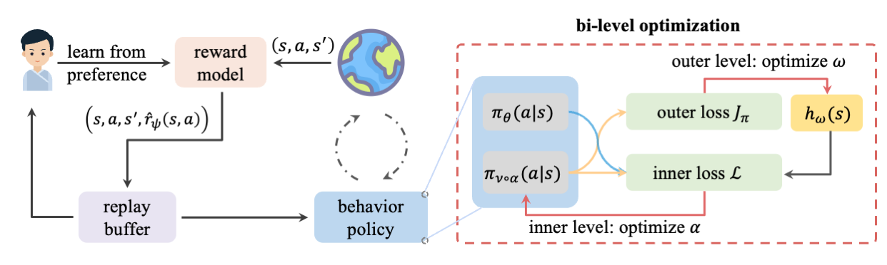

<div align="center">
  

# Adversarial Attacks on Deep Reinforcement Agents for Targeted Behaviors

<p align="center" style="border-bottom: 2px solid #000; width: 100%; margin: 0 auto;"></p>

  [](https://aaai.org/conference/aaai/aaai-2025) [](LICENSE) [](https://www.python.org/) [](https://arxiv.org/abs/2412.10713) [](https://sites.google.com/view/jj9uxjgmba5lr3g)

</div>

## Overview

<div align="center">
  
</div>
RAT is a framework for generating adversarial attacks that can manipulate deep reinforcement learning agents to exhibit targeted behaviors. The framework consists of three main components:

1. An intention model that serves as the learning objective for the adversary.
2. A weighting function is trained to adjust the state occupancy measure of replay buffer.
3. A adversary model that manipulates the victim to act human diresed behaviors.

## 🚀 Installation

### Prerequisites

- Python 3.8+
- CUDA 11.3+ (for GPU support)
- [MetaWorld](https://github.com/rlworkgroup/metaworld) environments

### Setup

1️⃣ Clone the repository:

```bash
git clone git@github.com:ChangWinde/RAT.git
cd RAT
```

2️⃣ Create and activate a virtual environment:

```bash
conda env create -f conda.yaml
conda activate rat
```

3️⃣ Install dependencies:

```bash
pip install -r requirements.txt
```

## 🎯 Training

### Adversarial Attacks on Targeted Behaviors

To train a Attacker on Manipulation Scenario:

```bash
python train_RAT_manipulation.py experiment=RAT_mani env=metaworld_door-lock-v2 seed=0 max_feedback=9000 outer_frequency=1000
```

To train a Attacker on Opposite Behaviors Scenario:

```bash
python train_RAT_oppo.py experiment=RAT env=metaworld_door-lock-v2 seed=0 outer_frequency=2000 max_feedback=7000
```

To train a robust agent via RAT-ATLA:

```bash
python train_RAT_mani_Robust.py experiment=RAT_Mani_Robust env=metaworld_door-lock-v2 seed=0 max_feedback=9000 outer_frequency=1000
```

Available environments:

- metaworld_door-lock-v2
- metaworld_door-unlock-v2
- metaworld_window-open-v2
- metaworld_window-close-v2
- metaworld_drawer-open-v2
- metaworld_drawer-close-v2
- metaworld_faucet-open-v2
- metaworld_faucet-close-v2

### Configuration

You can modify the training parameters in `config/train_RAT.yaml`. Key parameters include:

- `adv_eps`: Maximum perturbation size
- `num_train_steps`: Total number of training steps
- `max_feedback`: Total number of preference labels
- `outer_frequency`: How often outer level optimization
- `inner_frequency`: How often inner level optimization

### Monitoring

Training progress can be monitored through [Weights &amp; Biases](https://wandb.ai/). The following metrics are logged:

- 📈 Attacker's average episode reward
- 📉 True average episode reward
- ✅ Attack success rate
- 📋 Training losses

## 📝 Citation

If you find RAT useful in your research, please consider citing:

```bibtex
@inproceedings{bai2025rat,
  title={RAT: Adversarial Attacks on Deep Reinforcement Agents for Targeted Behaviors},
  author={Fengshuo Bai, Runze Liu, Yali Du, Ying Wen, Yaodong Yang},
  booktitle={Proceedings of the AAAI Conference on Artificial Intelligence},
  year={2025}
}
```

## 📄 License

This project is licensed under the MIT License - see the [LICENSE](LICENSE) file for details.

## 🙏 Acknowledgments

- [MetaWorld](https://github.com/rlworkgroup/metaworld) for the robotic manipulation environments
- [PEBBLE](https://github.com/pokaxpoka/B_Pref) for the backbone of PbRL
- [Weights &amp; Biases](https://wandb.ai/) for experiment tracking
